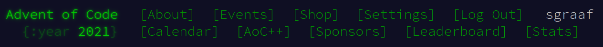

# 🎄 Advent of Code 2021 🌟

This repo contains my solutions for [Advent of Code 2021](https://adventofcode.com/2021/) in Python 🐍 using only the standard library. My solutions might not have the lowest possible computational complexity, but they should all feature good, clean (and largely functional) Pythonic code.

The solution to each day's puzzle (along with any input) is stored in its own directory:
* [Day 1: Sonar Sweep](./day01)
* [Day 2: Dive!](./day02)
* [Day 3: Binary Diagnostic](./day03)
* [Day 4: Giant Squid](./day04)
* [Day 5: Hydrothermal Venture](./day05)
* [Day 6: Lanternfish](./day06)
* [Day 7: The Treachery of Whales](./day07)
* [Day 8: Seven Segment Search](./day08)
* [Day 9: Smoke Basin](./day09)
* [Day 10: Syntax Scoring](./day10)
* [Day 11: Dumbo Octopus](./day11)
